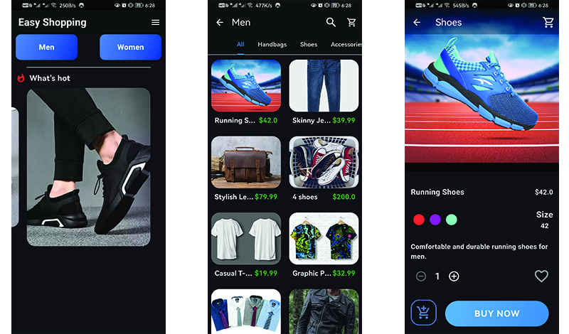
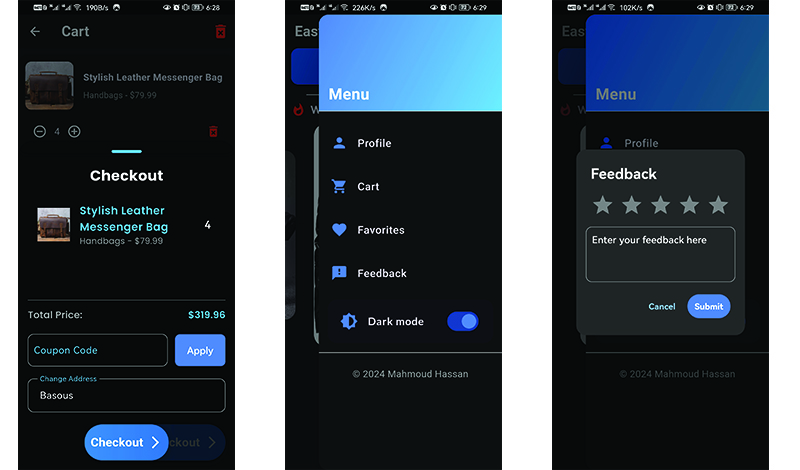
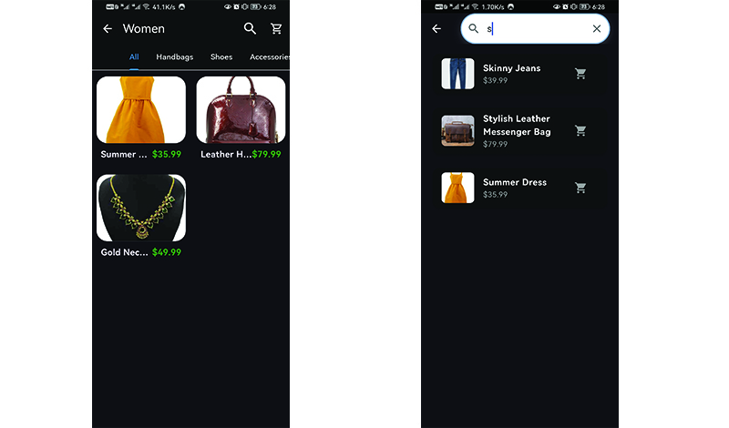

# 🛍️ Easy Shopping – Flutter & Firebase E-Commerce App

A powerful e-commerce solution built with **Flutter**, **Firebase** and **GetX**, featuring both a full-featured **Admin Dashboard** and a smooth **User Experience**. Designed with clean UI, advanced functionality, and scalable architecture.

---

## 📱 Overview

**Easy Shopping** is a complete shopping app featuring real-time inventory, admin controls, user profile customization, and order management — all powered by **Firebase**.

Built with clean architecture, dynamic UI updates, and a focus on practical business-ready features.

---

## 🛠️ Tech Stack & Tools

---

## 🎯 Features

### 🧑 User Side:

- 🔐 Sign In / Sign Up with Firebase Auth
- 👤 Custom profile (name, phone, address, profile photo)
- 🛍️ Browse & search products by category or keyword
- 📦 Add to cart, place orders, apply discount coupons
- 🌓 Dark mode support
- 🔄 Undo actions for accidental deletes
- 🔍 Search and filter items by preference
- ✍️ Submit feedback to the store

### 🛠️ Admin Dashboard:

- 📊 View stats and sales insights
- 🗃️ Manage inventory, orders, and categories
- 🧾 Generate & export **PDF invoices**
- 🎁 Create and manage coupons
- 🧑‍💼 View and manage user feedback
- 📞 One-tap phone call & WhatsApp redirection from profile
- ✍️ CRUD operations for products and user data
- 🌓 Dark mode support

---

## 📸 Screenshots

| User Interface                  | More User Screens               |
| ------------------------------- | ------------------------------- |
|  |  |
|  |

| Admin Dashboard Overview                         |
| ------------------------------------------------ |
|  |
|  |
|  |

---

## 📦 Packages Used

- [`firebase_auth`](https://pub.dev/packages/firebase_auth)
- [`cloud_firestore`](https://pub.dev/packages/cloud_firestore)
- [`get`](https://pub.dev/packages/get)
- [`google_fonts`](https://pub.dev/packages/google_fonts)
- [`fluttertoast`](https://pub.dev/packages/fluttertoast)
- [`pdf`](https://pub.dev/packages/pdf)
- [`image_picker`](https://pub.dev/packages/image_picker)
- [`url_launcher`](https://pub.dev/packages/url_launcher)
- [`shared_preferences`](https://pub.dev/packages/shared_preferences)

---

## 💡 What I Learned

- Building scalable e-commerce UI and logic using **GetX** (routing, state, controllers) and clean architecture.
- Managing admin/user roles with shared Firebase backends.
- Handling local and cloud data sync via Firebase and SQLite.
- Creating dynamic, reusable UI components.
- PDF generation, file handling, and feedback collection workflows.

---

## 🙌 Credits

Fully designed and developed from scratch by [**Mahmoud Hassan**](https://github.com/MahmoudHassan12).  
Inspired by real-world business needs and built with scalability, clean architecture, and usability in mind.

---

## 🚫 Disclaimer

This repository is provided for educational and portfolio purposes only.  
No actual payment gateway or sensitive data handling included.

---

## 🔗 Connect with Me

  

